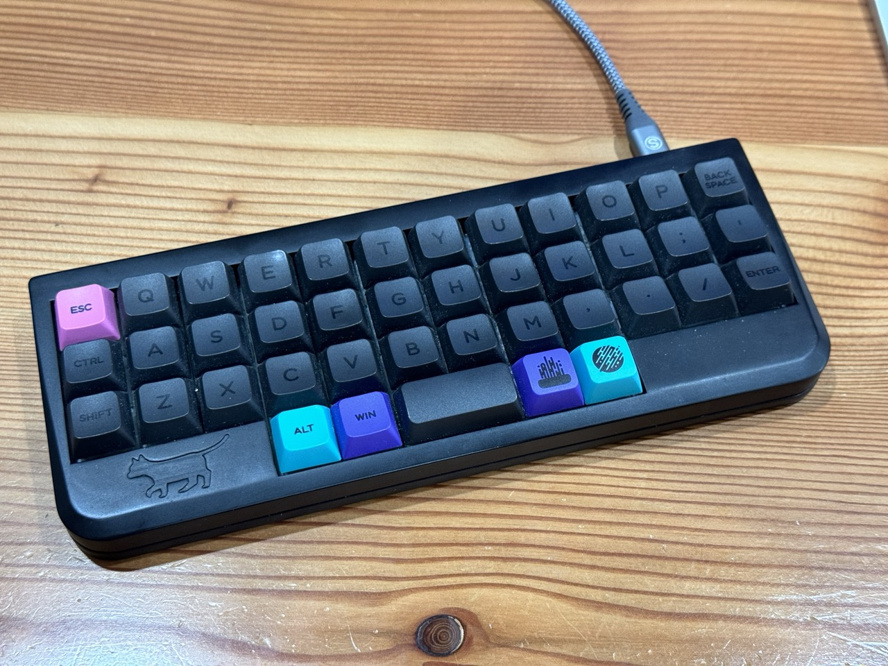

# necoboard


- RP2040
- Rust
- Electro-capacitive

40% keyboard

## Layout

```rust
impl Layout {
    const KEY_CODES_DEFAULT: [[Key; 12]; 4] = layout! {r"
        | Esc |  Q  |  W  |  E  |  R  |  T  |  Y  |  U  |  I  |  O  |  P  | Del |
        | LCtl|  A  |  S  |  D  |  F  |  G  |  H  |  J  |  K  |  L  |  ;  |  '  |
        | LSft|  Z  |  X  |  C  |  V  |  B  |  N  |  M  |  ,  |  .  |  /  |Enter|
        |     |     |     | LAlt| LGui|Space|     |     |     |     |     |     |
    "};
    const KEY_CODES_LOWER: [[Key; 12]; 4] = layout! {r"
        | Trn |  1  |  2  |  3  |  4  |  5  |  6  |  7  |  8  |  9  |  0  | Tab |
        | Trn |  !  |  @  |  (  |  )  |  *  |  -  |  =  |  [  |  ]  | Pipe|  `  |
        | Trn |  %  |  ^  |  #  |  $  |  &  |  _  |  +  |  {  |  }  |  \  |  ~  |
        |     |     |     | Trn | Trn | Trn |     |     |     |     |     |     |
    "};
    const KEY_CODES_RAISE: [[Key; 12]; 4] = layout! {r"
        | Trn |     |     |     |     |     |     |     |     |MVlDn|MMute|MVlUp|
        | Trn |     |     |     |     |     |     |     |     |     |  Up |     |
        | Trn |     |     |     |     |     |MPrev|MPlPs|MNext| Left| Down|Right|
        |     |     |     | Trn | Trn |     |     |     |     |     |     |     |
    "};
}
```
